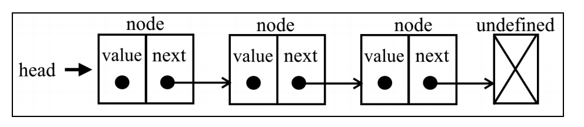

# 链表

链表存储有序的元素集合，但不同于数组，链表中的元素在内存中并不是连续放置的。每个
元素由一个存储元素本身的节点和一个指向下一个元素的引用（也称指针或链接）组成。

下图展示了一个链表的结构。


:::tip
相对于传统的数组，链表的一个好处在于，添加或移除元素的时候不需要移动其他元素。然而，链表需要使用指针，
因此实现链表时需要额外注意。在数组中，我们可以直接访问任何位置的任何元素，
而要想访问链表中间的一个元素，则需要从起点（表头）开始迭代链表直到找到所需的元素。
:::

## 单链表

```js
// 单链表

class Node {
  constructor(value) {
    this.value = value;
    this.next = null;
  }
}
class LinkedList {
  constructor(value) {
    if (!value) throw new Error('Invalid value');
    const newNode = new Node(value);
    this.head = newNode;
    this.tail = this.head;
    this.length = 1;
  }
  push(value) {
    const newNode = new Node(value);
    if (!this.head) {
      this.head = newNode;
      this.tail = newNode;
    } else {
      this.tail.next = newNode;
      this.tail = newNode;
    }
    this.length++;
    return this;
  }
  // 删除最后一个元素
  pop() {
    if (!this.head) return undefined;
    let temp = this.head;
    let pre = this.head;
    while (temp.next) {
      pre = temp;
      temp = temp.next;
    }
    this.tail = pre;
    this.tail.next = null;
    this.length--;
    if (this.length === 0) {
      this.head = null;
      this.tail = null;
    }
    return temp;
  }
  // 头部添加元素
  unshift(value) {
    const newNode = new Node(value);
    if (!this.head) {
      this.head = newNode;
      this.tail = newNode;
    } else {
      newNode.next = this.head;
      this.head = newNode;
    }
    this.length++;
    return this;
  }

  // 删除头部元素
  shift() {
    if (!this.head) return undefined;
    let temp = this.head;
    this.head = temp.next;
    this.length--;
    if (this.length === 0) {
      this.tail = null;
    }
    temp.next = null;
    return temp;
  }
  // 获取指定位置的元素
   get(index) {
    if (index < 0 || index >= this.length) return undefined;
    let temp = this.head;
    for (let i = 0; i < index; i++) {
      temp = temp.next;
    }
    return temp;
   }
   // 修改指定位置的元素
   set(index, value) {
    let temp = this.get(index);
    if (temp) {
      temp.value = value;
      return true;
    }
    return false;
   }
   // 在指定位置插入元素
   insert(index, value) {
     if (index === 0) return this.unshift(value);
     if (index === this.length) return this.push(value);
     if (index < 0 || index > this.length) return false;
     const newNode = new Node(value);
     const temp = this.get(index - 1);
     newNode.next = temp.next;
     temp.next = newNode;
     this.length++;
     return true;
   }

   // 删除指定位置的元素
   remove(index) {
     if (index === 0) return this.shift();
     if (index === this.length - 1) return this.pop();
     if (index < 0 || index >= this.length) return undefined;
     const temp = this.get(index - 1);
     const removed = temp.next;
     temp.next = temp.next.next;
     this.length--;
     return removed;
   }

   // 翻转链表
   reverse() {
    // 1. 首尾交换
    let temp = this.head;
    this.head = this.tail;
    this.tail = temp;
    // 2. 中间元素翻转
    let next = temp.next;
    let prev = null; // 设置一个变量，用来存储上一个元素
    for (let i = 0; i < this.length; i++) {
      next = temp.next;
      temp.next = prev;
      prev = temp;
      temp = next;
    }
    return this;
   }
}

```
## 反转链表

:::tip
给你单链表的头节点 head ，请你反转链表，并返回反转后的链表。

输入：head = [1,2,3,4,5]

输出：[5,4,3,2,1]
:::

```js
var reverseList = function (head) {
    if (head == null || head.next == null) {
        return head;
    }
    let prev = null;
    let curr = head;
    while (curr) {
        const next = curr.next;
        curr.next = prev;
        prev = curr;
        curr = next;
    }
    return prev;
};
```


## 合并两个有序链表
:::tip
将两个升序链表合并为一个新的 升序 链表并返回。新链表是通过拼接给定的两个链表的所有节点组成的。

输入：l1 = [1,2,4], l2 = [1,3,4]

输出：[1,1,2,3,4,4]

两个链表的节点数目范围是 [0, 50]

-100 <= Node.val <= 100

l1 和 l2 均按 非递减顺序 排列
:::

```js
var mergeTwoLists = function (l1, l2) {
    const prehead = new ListNode(-1);
    let prev = prehead;
    while (l1 && l2) {
        if (l1.val <= l2.val) {
            prev.next = l1;
            l1 = l1.next;
        } else {
            prev.next = l2;
            l2 = l2.next; 
        }
        prev = prev.next;
    }
    prev.next = l1 ? l2 : l1;
    return prehead.next;
}
```

## 删除链表的倒数第 N 个结点
:::tip
给你一个链表，删除链表的倒数第 n 个结点，并且返回链表的头结点。
输入：head = [1,2,3,4,5], n = 2
输出：[1,2,3,5]
:::
```js
var removeNthFromEnd = function(head, n) {
    const prehead = new ListNode(-1);
    prehead.next = head;
    let slow = prehead;
    let fast = prehead;
    while (n--) {
        fast = fast.next;
    }
    while (fast.next) {
        slow = slow.next;
        fast = fast.next;
    }
    slow.next = slow.next.next;
    return prehead.next;
}
```

## 判断环形链表

:::tip
给你一个链表的头节点 head ，判断链表中是否有环。

如果链表中有某个节点，可以通过连续跟踪 next 指针再次到达，则链表中存在环。 为了表示给定链表中的环，评测系统内部使用整数 pos 来表示链表尾连接到链表中的位置（索引从 0 开始）。注意：pos 不作为参数进行传递 。仅仅是为了标识链表的实际情况。

如果链表中存在环 ，则返回 true 。 否则，返回 false 。
:::
```js
// 快慢指针，如果有环，快指针一定会追上慢指针
var hasCycle = function(head) {
    let slow = head;
    let fast = head;
    while (fast && fast.next) {
        slow = slow.next;
        fast = fast.next.next;
        if (slow === fast) {
            return true;
        }
    }
    return false;
}
```

## 相交链表

:::tip
给你两个单链表的头节点 headA 和 headB ，请你找出并返回两个单链表相交的起始节点。如果两个链表不存在相交节点，返回 null 。
:::

```js
var getIntersectionNode = function(headA, headB) {
    let p1 = headA;
    let p2 = headB;
    while (p1 !== p2) {
        p1 = p1 ? p1.next : headB;
        p2 = p2 ? p2.next : headA;
    }
    return p1;
}
```